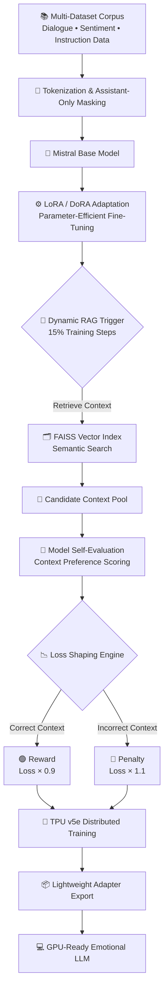

# EmpathyEngine-RAG
### Scaling Emotional Intelligence: Training a High-Fidelity Affective Model on TPU v5e-8 using DoRA and Dynamic Context Retrieval.

---

## 🚀 Overview

EmpathyEngine-RAG explores a simple but important question:

> Can a language model learn not only to be correct — but to be emotionally aware?

Traditional fine-tuning teaches Large Language Models to reproduce patterns found in text. While effective, this often produces responses that are logically accurate yet emotionally flat.

This project introduces a **Retrieval-Aware Training Loop** where the model actively consults external knowledge *during training itself*. Instead of passively memorizing data, the model learns to evaluate context and adjust its behavior accordingly.

The result is a system that learns:

- how to generate meaningful responses  
- how to ground answers in relevant context  
- how to respond with socially and emotionally appropriate tone

In short, the model learns not just **what to say**, but **when context improves understanding**.

---

## 🌑 The Mission — Breaking the *Robotic Barrier*

Modern LLMs often suffer from what we call **Emotional Flattening**.

They provide answers that are technically correct but socially unaware — missing moments where empathy, reassurance, or excitement matter.

Examples include situations where users need:

- comfort during negative experiences  
- encouragement or motivation  
- nuanced conversational understanding  
- emotionally aligned responses

When emotion is missing, AI feels mechanical — more like a tool than a companion.

The goal of this project is to bridge that gap by combining:

- computational reasoning  
- contextual grounding  
- human-centric emotional awareness

---

## 🌕 The Technical Breakthrough

To move beyond conventional fine-tuning, we designed a **dual-stream training pipeline** that balances large-scale learning power with efficient deployment.

### ⚡ High-Power Training → Lean Inference

Training was performed using **8 TPU v5e cores**, allowing large-scale experimentation without modifying the base model’s full parameter set.

Key ideas:

- Over **2,000 training steps** across multiple epochs
- Parameter-efficient learning using **DoRA (Weight-Decomposed Low-Rank Adaptation)**
- Performance approaching full fine-tuning with only lightweight adapter updates

After training, only the adapters are exported, enabling smooth real-time inference on standard consumer GPUs.

This creates a practical workflow:

**Massive compute during training → accessible deployment during inference.**

---

### 🧠 Dynamic RAG-Loss Shaping

The central innovation of this project lies in how retrieval is used.

Instead of applying Retrieval-Augmented Generation only at inference time, we integrate retrieval directly into the learning process.

A custom `InternalTrainer` evaluates the model while gradients are being computed:

1. Relevant context is retrieved from a FAISS vector index  
2. The model compares candidate responses  
3. The loss function is dynamically adjusted

If the model prefers grounded, contextually accurate information:

✅ the loss is reduced (reward)

If it ignores useful context or follows noisy generation:

❌ the loss is increased (penalty)

Over time, the model learns to naturally favor responses that are both **factually grounded and emotionally appropriate**.

---

## 🏛️ The Architecture of Empathy (Training Data)

Emotional intelligence cannot emerge from a single dataset.  
It requires exposure to multiple forms of human communication.

To achieve this, we constructed a **multi-dimensional training corpus** combining datasets that capture different aspects of conversation and reasoning. The dataset is exposed to a wide spectrum of:

- human interaction patterns
- emotional expression
- conversational reasoning
- instruction-following behavior

### Dataset Composition

| Dimension | Datasets Used | Purpose in the Model |
|---|---|---|
| **Logic & Flow** | `ultrachat_200k` | Establishes high-quality, complex instruction-following capabilities |
| **Social Nuance** | `daily_dialog`, `better_daily_dialog`, `simple_daily` | Teaches natural conversational rhythm and everyday social etiquette |
| **Sentiment Depth** | `imdb` | Improves recognition and mirroring of strong human emotions |
| **Human Alignment** | `oasst1` | Provides human-curated assistant responses for natural interaction |
| **Instructional Grit** | `chatbot_instruction_prompts` | Maintains task focus while preserving empathetic behavior |

---

## ⚙️ Technical Specifications & Stack

### 🖥️ Compute
- **Training:** Google Cloud TPU v5e-8 (Kaggle TPU environment)
- **Inference:** Universal GPU compatibility

### 🧠 Model
- **Base Model:** Mistral-7B-v0.1 (instruction-optimized)
- **Optimization:** DoRA (Rank = 8, Alpha = 16) for stable adapter learning
- **Precision:** `bfloat16` to maximize TPU MXU throughput and prevent gradient overflow

### 🔎 Retrieval System
- **Vector Database:** FAISS (`IndexFlatIP`)
- **Embeddings Model:** `all-MiniLM-L6-v2`
- **Search Type:** Sub-millisecond semantic similarity retrieval

---

## 🧠 What This Achieves

Through retrieval-aware training, the model learns:

- not only **how to respond**
- but **when external knowledge improves emotional and factual quality**

This shifts RAG from being a simple inference enhancement into a **true learning signal** embedded within optimization itself.

---

## 🧩 System Architecture — Retrieval-Aware Emotional Training Pipeline

The EmpathyEngine-RAG framework transforms traditional fine-tuning into a
**retrieval-aware emotional learning system**, where contextual knowledge
actively influences gradient optimization during training.

---

### 🚀 Run the Project

&nbsp;&nbsp;&nbsp;

## 🧩 System Architecture — Retrieval-Aware Emotional Training Pipeline
https://colab.research.google.com/#fileId=https://huggingface.co/ny-amit111/sentence_generator-v1/blob/main/generator_motor%20(1).ipynb
